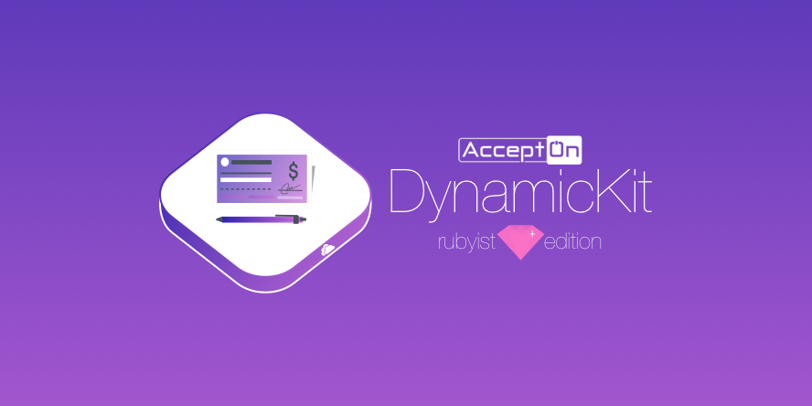

[](http://badge.fury.io/rb/accepton-ruby)
[](https://circleci.com/gh/accepton/accepton-ruby)
[](https://github.com/accepton/accepton-ruby/blob/master/LICENSE)
[](https://twitter.com/AcceptOnHQ)

# What is this?
The [AcceptOn](https://accepton.com) *DynamicKit* for rubyist.  Used for your backend integration with AcceptOn.

## Setup

#### 1. Install the gem
```sh
>gem install accepton
```

#### 2. Continue with the documentation
  - [Dynamic Kit Getting Started Guide](http://developers.accepton.com/guides/dynamic_kit.html)
  - [Dynamic Kit Full API Reference](http://developers.accepton.com/guides/dynamic_kit_full_api.html)

## Contributing
> ♥ This project is intended to be a safe, welcoming space for collaboration, and contributors are expected to adhere to the [Contributor Covenant](http://contributor-covenant.org) code of conduct.

- If you **found a bug**, open an issue.
- If you **have a feature request**, open an issue.
- If you **want to contribute**, submit a pull request.

## Versioning
This project adheres to [Semantic Versioning 2.0.0](http://semver.org/spec/v2.0.0.html). Any violations of this scheme are considered to be bugs.
